# Trinetra-The-Third-Eye-of-Intelligent-Protection.
AI-powered pilgrimage safety platform for Gujarat's four-temple circuit. Real-time crowd surge detection, SOS alerts, and QR-tracked group coordination via one shared physical stole. The third eye watching over every pilgrim.
<div align="center">

# 🕉️ Trinetra

### One Thread. Three Watchful Eyes. No Pilgrim Walks Unseen.

**A unified digital + physical pilgrimage circuit system for Somnath, Dwarka, Ambaji & Pavagadh**
*Built for Problem Statement `SVH26008` — Temple & Pilgrimage Crowd Management, Government of Gujarat*

<br/>


<br/>

[](#)
[](#)
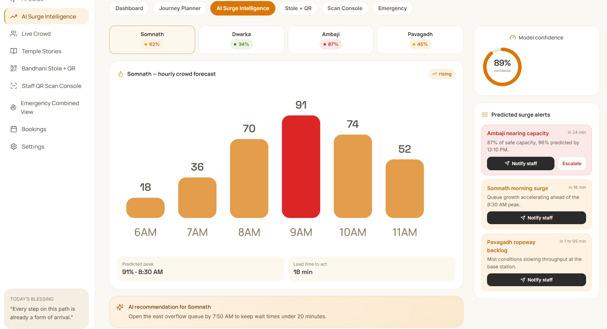
*The Dashboard — pilgrims on circuit, active SOS, average safety score, and crowd pressure at all four temples, in one glance.*
</div>
<br/>

---

## 📑 Table of Contents

- [Overview](#-overview)
- [Why This Matters](#-why-this-matters)
- [Problem Statement](#-problem-statement)
- [Existing Challenges](#-existing-challenges)
- [Our Solution](#-our-solution)
- [System Architecture](#-system-architecture)
- [System & User Workflow](#-system--user-workflow)
- [Features](#-features)
- [Technology Stack](#-technology-stack)
- [Getting Started](#-getting-started)
- [Screenshots](#-screenshots)
- [API Documentation](#-api-documentation)
- [Surge Detection Engine](#-surge-detection-engine)
- [Data Model](#-data-model)
- [Performance Targets](#-performance-targets)
- [Security Measures](#-security-measures)
- [Scalability](#-scalability)
- [Future Roadmap](#-future-roadmap)
- [Challenges Faced](#-challenges-faced)
- [Design Decisions & What We Learned](#-design-decisions--what-we-learned)
- [Hackathon Theme Alignment](#-hackathon-theme-alignment)
- [SDGs Supported](#-sdgs-supported)
- [Innovation & Competitive Edge](#-innovation--competitive-edge)
- [Team](#-team)
- [Testing](#-testing)
- [Deployment](#-deployment)
- [License](#-license)
- [Acknowledgements](#-acknowledgements)
- [Contact & Support](#-contact--support)

---

## 🌟 Overview

**Trinetra** treats four of Gujarat's most-visited temples — **Somnath, Dwarka, Ambaji, and Pavagadh** — as what pilgrims already treat them as: **one connected journey**, not four separate errands.

The system pairs a single cross-temple booking app with a genuinely novel physical mechanic: a **borrowed Bandhani stole**, Gujarat's GI-recognized heritage textile, stitched with one QR tag. A pilgrim receives it at their first temple, it's scanned at every stop along their circuit, and it's returned at the last — with a small printed keepsake handed back as their memory of completing the journey. It's a circulating loaner pool, not a per-person giveaway, which is what makes it affordable at scale.

Layered on top: three role-based dashboards, a lightweight real-time surge-detection technique, and a festival calendar that flags known high-risk dates in advance.

## 💡 Why This Matters

These aren't hypothetical crowds. Somnath's **Kartik Purnima Mela** has run every year since 1955 and regularly extends temple hours to 1 AM to manage turnout. Ambaji sees documented lakhs-strong crowds during **Navratri** and **Bhadra Purnima**. These are recurring, dated, high-risk events — and right now, no system connects what happens at one temple to what's happening at the other three a pilgrim is about to visit.

## ❗ Problem Statement

Pilgrims visiting Somnath, Dwarka, Ambaji, and Pavagadh overwhelmingly travel them as a single circuit — existing tour operators already package all four together. Yet every current system books, queues, and manages crowd safety at each temple **in isolation**. Nobody warns a pilgrim if their booked slots across sites are even physically possible to travel between in time, and there's no combined view for the teams responsible for keeping all four sites safe.

## 🚧 Existing Challenges

- Independent booking per temple — no visibility across the full circuit
- No warning when two temple bookings are impossible to travel between in time
- Accessibility needs have to be re-declared at every single gate
- Crowd status is visible per-temple only, never as one combined picture
- Known high-surge festival dates aren't flagged to staff or emergency teams in advance
- Older "proof of visit" mechanics (physical stamps, per-person tokens) don't scale affordably across four separately-run temple trusts

## 🔍 Why These Problems Are Genuine 

Worth being ready to defend: this problem doesn't require professional market research or insider government data to validate. It's public record, and any team — at any experience level — can verify it with an afternoon of searching.

**The pattern is national, not invented.** Fatal crowd crushes at Indian religious gatherings recur every few years, at different temples, in different states — the signature of a systemic, unmanaged crowd-density problem, not a one-off accident:

- <cite index="10-1">A pre-dawn stampede at the Maha Kumbh Mela in Prayagraj killed at least 30 people in January 2025 when a surging crowd broke through a police cordon.</cite>
- <cite index="24-1">A crowd crush at the Vaishno Devi shrine on New Year's Day 2022 killed 12 people and injured 16 more.</cite>
- <cite index="11-1">A stampede among pilgrims returning from the Sabarimala shrine in Kerala killed 102 people in 2011.</cite>
- <cite index="21-1">A stampede at the Naina Devi temple in Himachal Pradesh killed 146 people in August 2008.</cite>
- <cite index="3-1">A stampede at a religious fair at the Mandhardevi temple in Maharashtra killed more than 340 devotees in January 2005.</cite>

**The scale at these specific sites is already documented, too.** <cite index="18-1">Ambaji's Bhadarvi Purnima fair alone draws over a million devotees from Gujarat and neighboring states</cite>, and <cite index="17-1">the queues during the week-long fair are reported to stretch for kilometers, with the temple staying open all night</cite>. That's on top of Somnath's Kartik Purnima Mela, which has run continuously since 1955 and regularly extends temple hours to 1 AM.

**What a 2nd-year team can check for themselves, no special access required:**
- Search any of the four temple names + "darshan booking" — each currently runs its own separate, unconnected portal.
- Search "Somnath Dwarka Ambaji Pavagadh tour package" — established travel agencies already sell all four as one circuit, direct evidence pilgrims already travel this route together.
- Search "temple stampede India" in any news archive — the timeline above surfaces in minutes, because it's public reporting, not proprietary research.

If a judge or mentor asks *"how do you know this is real, not something you assumed?"* — the honest answer is that it isn't something the team found through special access. It's a pattern reported on for two decades, at exactly the kind of large, unregulated religious gathering these four temples already host every year.

## ✅ Our Solution

We're building five connected pieces:

1. **A cross-temple booking app** — plan the entire circuit in one go, get warned if two bookings are impossible to travel between in time, and book as a group with accessibility needs flagged once, not per-temple.
2. **A borrowed Bandhani stole system** — issued at the first temple, scanned at each subsequent stop, returned at the last, with a printed keepsake at the end. One circulating pool, reused across pilgrims — not manufactured per person.
3. **Three role-based dashboards** — pilgrim (plan/book), staff (update crowd status, scan passes), and emergency/support (a combined view across all four temples).
4. **A real-time surge alert** — a lightweight technique adapted from an earlier team project, *NeuralWatch*, that catches dangerously fast crowd buildup rather than just raw headcount.
5. **A festival calendar layer** — known high-surge dates (Kartik Purnima, Navratri, Bhadra Purnima) flagged in advance so staff and emergency teams go in prepared.
  **What that looks like, piece by piece:**

| 1. Booking app | 2. Stole + QR | 3. Combined dashboard view | 4. Surge alert |
|---|---|---|---|
|  | 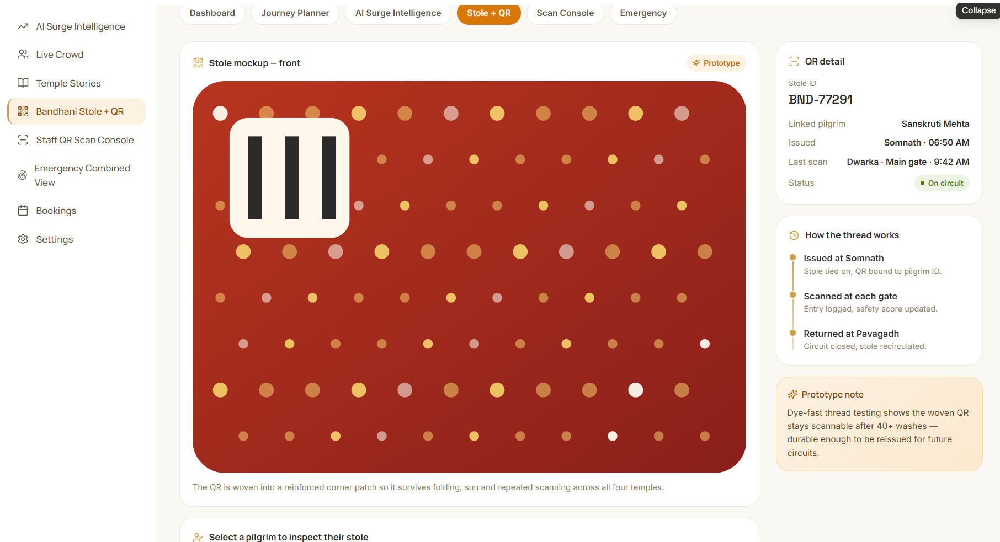 | 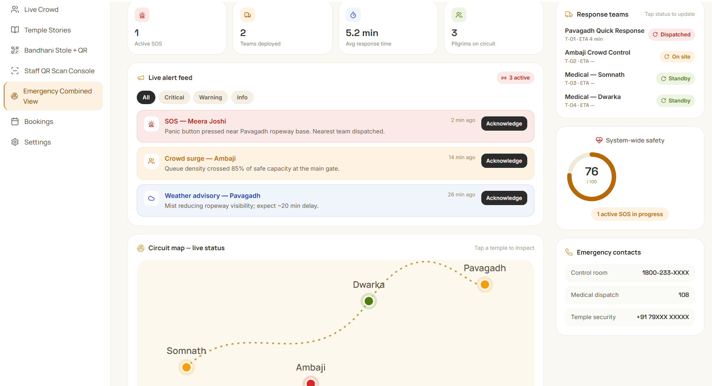 | 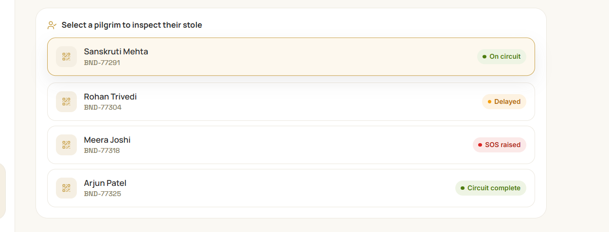 |

*(Piece 5, the festival calendar layer, doesn't have a built screen yet.)*

> **Scope, stated honestly:** the pilgrim + staff dashboards and the stole loaner system are our non-negotiable core. The emergency dashboard and surge model are being built if time allows — and presented as designed future capability otherwise. We'd rather be transparent about what's real than claim more than what's built.

## 🏗️ System Architecture

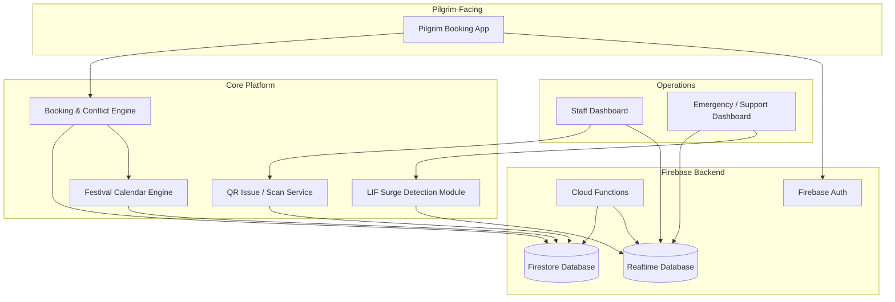

Booking, stole issue/scan/return, conflict checks, and surge evaluation all run as Firebase Cloud Functions, backed by Firestore for structured records and the Realtime Database for live crowd-status sync across dashboards.

## 🔄 System & User Workflow

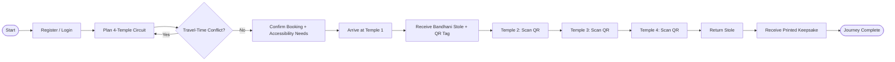

A pilgrim plans their whole circuit up front. The app rejects impossible combinations before they're booked. From there, the stole *is* their pass — one physical object, one QR, tracked start to finish.

## ✨ Features

#### 🧠 Smart / Surge Features

*Per-temple hourly forecast, predicted peak, lead time to act, and a model-confidence score.*
- Real-time surge alert based on rate-of-buildup, not just raw headcount
- Festival calendar layer flagging known high-risk dates in advance

#### 🙏 Pilgrim Features
- Single booking flow across all four temples
- Automatic travel-time conflict detection between temple slots
- Group booking with accessibility needs flagged once for the whole group
- One physical stole + QR as a single pass for the entire circuit
- Printed keepsake on completion of the journey

#### 🔐 Security
- Role-based access for pilgrim, staff, and emergency dashboards
- Every crowd-status update logged with staff ID and timestamp
- QR tags bound to a stole ID, not to personal pilgrim data

#### 📊 Analytics

- Live per-temple occupancy and surge-level view
- Combined four-temple status for emergency/support teams
- Historical status-update logs for post-event review

#### 🛠️ Admin / Staff
| QR Scan Console | Stole → Pilgrim Lookup |
|---|---|
|  | 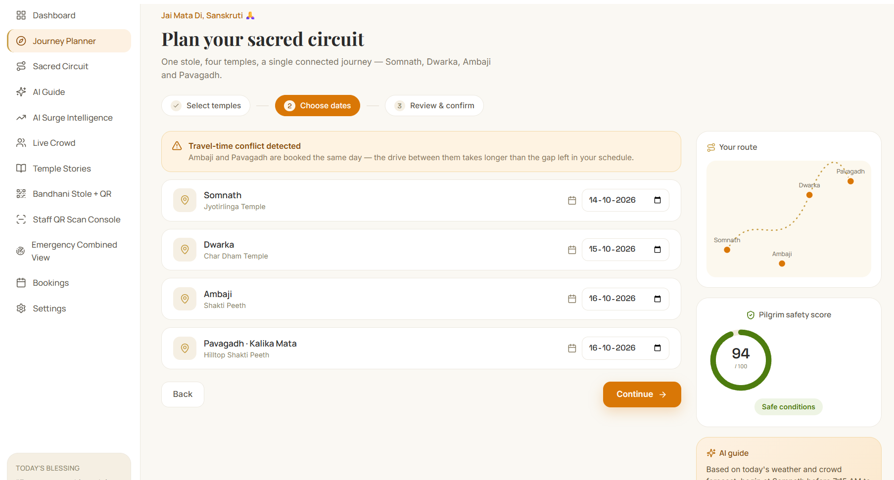 |
- One-tap crowd status updates
- QR scan console for stole issue / scan / return
- Stole inventory tracking (in circulation / available / returned)

## 🛠️ Technology Stack

| Layer | Technology | Why We Chose It |
|---|---|---|
| Frontend (Pilgrim + Staff web apps) | HTML5, CSS3, Bootstrap 5, JavaScript | Fast to build with no framework overhead — right fit for a first-hackathon build |
| Realtime sync | Firebase Realtime Database | Live crowd-status sync across dashboards with no custom server |
| Primary database | Cloud Firestore | Structured storage for bookings, stole assignments, festival events |
| Serverless logic | Firebase Cloud Functions (Node.js) | Booking validation, stole issue/scan/return, conflict checks |
| Authentication | Firebase Authentication (Phone OTP) | Low-friction pilgrim sign-in, role-based staff login |
| QR generation & scanning | `qrcode` (Node), `html5-qrcode` (browser) | Small, well-documented, camera-based — no extra hardware |
| Travel-time reference | Google Maps Distance Matrix API (static snapshot) | Approximate drive-time data used in conflict checks |
| Notifications | Firebase Cloud Messaging | Surge alerts and booking confirmations |
| Hosting | Firebase Hosting | One-command deploy, free tier covers a hackathon build |
| Surge detection | Custom LIF-inspired JS module | Lightweight, explainable, real-time — needs no training data |

*(Update this table if your team's actual implementation differs.)*


## 🚀 Getting Started

### Prerequisites
- Node.js ≥ 18 and npm
- [Firebase CLI](https://firebase.google.com/docs/cli): `npm install -g firebase-tools`
- A Firebase project with **Firestore**, **Realtime Database**, and **Authentication** enabled

### Installation
```bash
git clone https://github.com/yourusername/trinetra.git
cd trinetra
npm install
```

### Environment Variables
Create a `.env` file from the template below:

```env
FIREBASE_API_KEY=
FIREBASE_AUTH_DOMAIN=
FIREBASE_PROJECT_ID=
FIREBASE_STORAGE_BUCKET=
FIREBASE_MESSAGING_SENDER_ID=
FIREBASE_APP_ID=
FIREBASE_DATABASE_URL=
GOOGLE_MAPS_API_KEY=
```

### Running Locally
```bash
firebase emulators:start
npm run dev
```


## 📸 Screenshots

*In the order you'll actually navigate the app.*

| Dashboard (Overview) |
|---|
|  |

<details>
<summary>Pilgrim Booking Flow — all 3 steps</summary>

| 1. Select temples | 2. Choose dates (conflict check) | 3. Review & confirm |
|---|---|---|
|  | 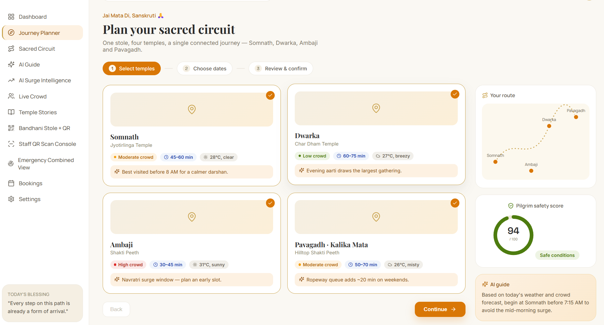 | 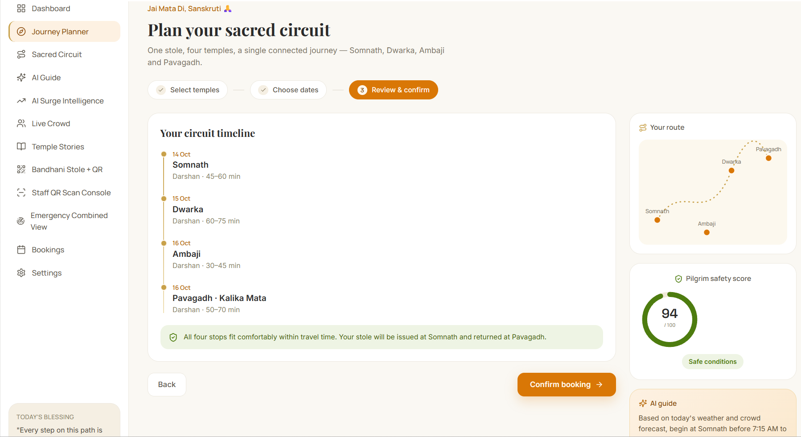 |

</details>

| AI Surge Intelligence |
|---|
|  |

| Bandhani Stole + QR Prototype |
|---|
|  |

<details>
<summary>Stole → pilgrim lookup</summary>


</details>

| Staff QR Scan Console |
|---|
|  |

| Emergency Combined View |
|---|
|  |

## 📡 API Documentation

| Endpoint | Method | Description |
|---|---|---|
| `/bookings/validate` | `POST` | Validates a proposed 4-temple booking against travel-time conflicts |
| `/stole/issue` | `POST` | Issues a stole + QR to a pilgrim at their first temple |
| `/stole/scan` | `POST` | Logs a stole scan at an intermediate temple |
| `/stole/return` | `POST` | Closes out a stole assignment and triggers keepsake printing |
| `/temples/:id/status` | `GET` | Returns current crowd status and surge level for a temple |

**Example — `POST /stole/issue`**
```json
{
  "pilgrimId": "plg_10234",
  "stoleId": "stole_007",
  "issuedTempleId": "somnath"
}
```
**The same flow, in the actual app:**


| Plan 4-Temple Circuit | Travel-Time Conflict? | Confirm Booking |

|---|---|---|

|  |  |  |


The middle screenshot is the `CK{"Travel-Time Conflict?"}` branch from the diagram above, caught live — Ambaji and Pavagadh booked the same day, flagged before confirmation is even possible.


| Receive Bandhani Stole + QR Tag |

|---|

|  |
**Booking + stole lifecycle:**

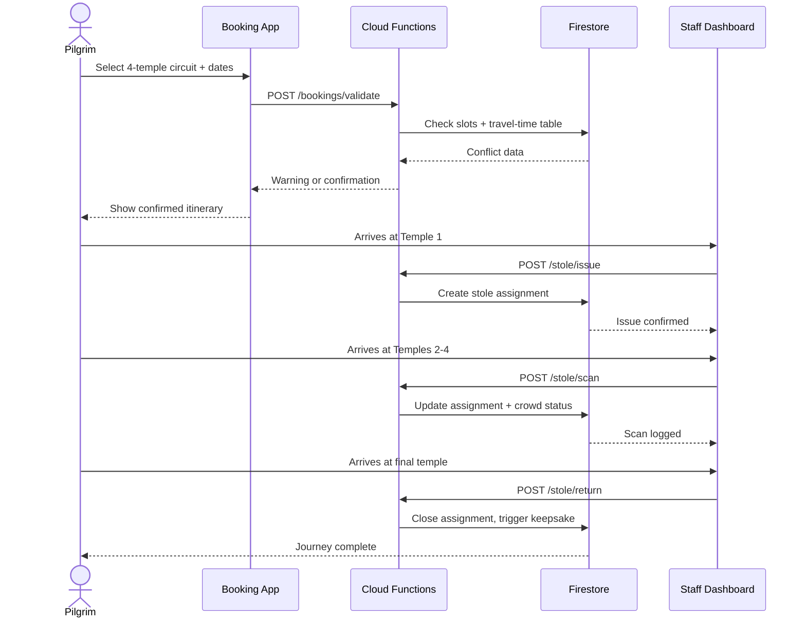

## 🧠 Surge Detection Engine

We're being deliberately honest about this: this is **not** a trained machine-learning forecasting model. It's a genuine, adapted technique — a real algorithm, not a black box, and not overclaimed as full predictive AI.

- **Dataset:** none required — it runs on live staff-reported headcount updates, not a historical training set.
- **Model:** a **Leaky-Integrate-and-Fire (LIF)** inspired approach, adapted from an earlier team project, *NeuralWatch*. Each incoming update acts like an input current; a "surge potential" accumulates and decays over time.
- **Training:** none in the ML sense — thresholds are tuned by hand against expected scenarios, not learned from data.
- **Inference:** evaluated in real time as each new staff update arrives.
- **Evaluation:** tested against simulated tabletop scenarios rather than historical logs, since no dataset yet exists for these sites.

```
surgePotential = surgePotential * decayFactor + incomingRateSignal
if surgePotential > threshold:
    triggerSurgeAlert(templeId)
```

The leak/decay framing is what separates a genuinely dangerous fast buildup from safe, slow, normal growth — something a flat moving average doesn't do as well. It's **reactive, not predictive**: it catches surges as they happen, not before, based on historical data, weather, or festival patterns.

## 🗄️ Data Model

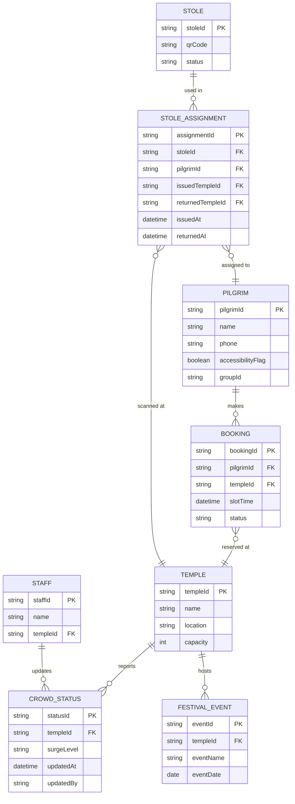

## 📊 Performance Targets

> These are **design goals for the hackathon build**, not measured production benchmarks.

| Metric | Target |
|---|---|
| QR scan → confirmation | < 2 seconds |
| Booking conflict check | < 1 second |
| Staff status propagation to dashboards | Near-instant (Firebase-managed) |
| Surge alert latency after threshold crossed | < 5 seconds |
| Hackathon demo stole pool | 2–5 loaner stoles |

## 🔐 Security Measures

- Firebase Authentication with phone OTP for pilgrims and role-based login for staff/emergency teams
- Firestore security rules scoping staff writes to their assigned temple only
- Every crowd-status update logged with staff ID and timestamp, creating an accountability trail
- QR tags bound to a stole ID rather than personal pilgrim data
- HTTPS-only across Firebase Hosting and Cloud Functions

Stated honestly: this logs *who* updated a status and *when* — it can't force staff to be accurate. That's an operational and policy matter, not something software alone can guarantee.

## 📈 Scalability

The circulating stole pool is the core scalability decision: reusing a small pool of stoles is far cheaper to run at volume than manufacturing one per pilgrim. The same model is designed to be **replicable to other Indian pilgrimage circuits** — Char Dham is the most direct example — without redesigning the underlying system. Firebase's managed infrastructure also means the team isn't operating servers directly as usage grows.

## 🗺️ Future Roadmap

- Live computer-vision or IoT sensors for crowd counting (currently: staff-reported + booking data only)
- Live traffic data replacing the current static travel-time reference table
- Full predictive AI/ML forecasting using historical crowd data, weather, and festival patterns (currently: reactive surge detection only)
- Automated emergency-response dispatch (currently: alerts and notifications, not automated dispatch)
- Solving multi-trust physical stole logistics at real deployment scale
- Extending the circuit model to other Indian pilgrimage networks (e.g., Char Dham)

## 🧗 Challenges Faced

Stated upfront, honestly — and why each one exists, not just what it is. We're a second-year AI/ML team; none of us has shipped a production system before this, so most of these limits come from real constraints (time, data access, hardware, skill depth) rather than oversight. Where we could reduce the risk without pretending the limit doesn't exist, we did.

1. **Staff-reporting reliability** — the system can log who updated status and when, but can't force accuracy. This is genuinely a policy/training problem, not a software one — no app can make a tired volunteer count correctly during a festival crush. *What we did:* we added a staff-ID + timestamp audit trail specifically so inaccurate updates are at least traceable after the fact, and kept the update action to one tap so there's less room for entry error under pressure.
2. **Reactive, not predictive** — the surge model detects fast buildup as it happens; it doesn't forecast using historical data, weather, or festival calendars. We don't have historical crowd datasets for these four temples — they don't publicly exist — so training a real forecasting model wasn't honestly possible in this timeframe with our current ML background. *What we did:* rather than fake a "predictive AI" claim, we built the festival calendar as a deliberately simple, rule-based stand-in — flagging known high-risk dates in advance — which gets some of the benefit of foresight without overclaiming a model we didn't build.
3. **No automated emergency response** — the system alerts and notifies; it doesn't dispatch resources or detect panic automatically. Automated dispatch means integrating with real emergency-service infrastructure and decision authority that a student prototype has no business claiming to control. *What we did:* scoped this down to reliable, fast notification instead — getting the right alert to the right dashboard quickly is itself a meaningful safety improvement over the current no-visibility baseline.
4. **Static travel-time data** — conflict-checking uses researched approximate drive times, not live traffic. A live Maps API integration adds cost, quota limits, and a network-dependency point of failure we couldn't stress-test reliably in a hackathon window. *What we did:* used real, researched drive-time figures between the four temples rather than guessed numbers, so the static table is still grounded in accurate data — just not live-updating.
5. **Reduced no-tech fail-safe vs. stamps** — if QR scanning fails, a volunteer can tell someone is mid-circuit but not precisely which stops are done without the scan record. This is a genuine trade-off of choosing a digital-first mechanic over a purely physical one. *What we did:* kept the stole itself as a visible, low-tech signal (issued/not yet returned is obvious on sight) so the system degrades to "mostly informative" rather than "completely blind" if scanning fails.
6. **Physical logistics at scale** — real deployment across four separately-run temple trusts (handout points, return points, inventory) isn't mapped out yet; this is a hackathon-scale prototype. Coordinating physical operations across four independently governed institutions is an administrative and logistical problem outside what a student team can design in isolation — it needs input from the trusts themselves. *What we did:* designed the stole-inventory tracking (in circulation / available / returned) so that whatever logistics plan eventually gets adopted, the software side is already ready to support it.
7. **No computer vision or IoT sensors** — crowd counts come from staff and bookings, not cameras or sensors. We don't have camera hardware, labeled crowd-density datasets, or prior CV coursework to build this credibly — attempting it would mean shipping something we couldn't vouch for. *What we did:* chose the LIF-inspired surge module specifically because it's a real, explainable technique we could learn and implement correctly with our current skill level, instead of stretching into computer vision and shipping something we didn't understand well enough to defend.

## 📚 Design Decisions & What We Learned

| Decision | Why |
|---|---|
| Queue/access/engagement over IoT/CV/full ML forecasting | Not feasible to build credibly with no prior coding experience in this timeframe; kept as honest future-work items |
| Bandhani stole over kalava thread or diyas | Durable, worn prominently, GI-tagged Gujarat heritage craft, directly tied to the "Heritage & Culture" theme |
| Borrow-and-return over stamped-and-kept | Far cheaper at scale — one circulating pool instead of a fresh item per pilgrim |
| Small printed keepsake at return | Recovers the "I completed the journey" payoff without a per-person physical item cost |
| LIF surge model over full ML crowd prediction | Genuinely learnable and buildable without training data or ML expertise, while still being a real, defensible technique |
| Group-level (not per-person) accessibility flagging | Keeps the data model simple enough to build reliably in the time available |
| Static (not live) travel-time data | Removes a live-API dependency risk from the demo while remaining a reasonable, disclosed simplification |
| Added a festival-calendar feature | An honest, low-effort step toward the "prediction" ask without overclaiming forecasting that isn't built |

## 🏛️ Hackathon Theme Alignment

Built for Problem Statement **`SVH26008` — Temple & Pilgrimage Crowd Management**, issued by the **Government of Gujarat**. The Bandhani stole directly answers the "Heritage & Culture" angle of the theme — not as decoration, but as the literal mechanic pilgrims interact with throughout their journey.

## 🌍 SDGs Supported

We picked these five deliberately, not by scanning a checklist for keywords that sound related. Each one maps to a specific mechanic already built into the system:

- **SDG 3 — Good Health & Well-Being.** The stampedes cited above (Kumbh 2025, Vaishno Devi 2022, Sabarimala 2011, Naina Devi 2008, Mandhardevi 2005) are all crowd-density failures, not isolated accidents. The surge-detection module exists specifically to catch dangerous buildup speed before it becomes one of these — that's a direct, not symbolic, link to preventing death and injury at gatherings.
- **SDG 8 — Decent Work & Economic Growth.** Pilgrimage tourism is a real, recurring source of local income for temple towns — guides, vendors, transport, and lodging around Somnath, Dwarka, Ambaji, and Pavagadh all depend on steady, safe footfall. A system that prevents shutdowns and panic-driven closures keeps that economic activity running instead of interrupting it after an incident.
- **SDG 9 — Industry, Innovation & Infrastructure.** The circulating stole-and-QR model is intentionally low-cost, hardware-light infrastructure (no cameras, no IoT, no server fleet) that a resource-constrained temple trust could realistically fund and maintain — infrastructure innovation measured by what's deployable, not just what's technically impressive.
- **SDG 11 — Sustainable Cities & Communities.** Safer management of high-density public/religious spaces is one of the explicit sub-targets under this goal (target 11.7, safe and inclusive public spaces). Four temples coordinating through one shared crowd-status view is a direct, structural step toward that, not an indirect one.
- **SDG 17 — Partnerships for the Goals.** The system only works if a state government body and four independently-run temple trusts share data and operating protocol. That cross-institution coordination — not just the app — is the actual partnership this SDG is about.

We're not claiming all five are equally strong; SDG 3 and SDG 11 are the ones we'd defend hardest under questioning, since they map to the core mechanic. SDG 8, 9, and 17 are real but secondary effects of the same system.

## 🏆 Innovation & Competitive Edge

- **Circuit-first, not single-temple.** Most competing teams will likely build a single-temple queue app. We treat this as one connected journey — matching how these sites are actually promoted and traveled.
- **A physical object, not just a screen.** The Bandhani stole gives judges something tangible and instantly understandable — a real, GI-recognized heritage textile — while staying a low-cost, circulating system rather than an ever-growing manufacturing cost.
- **Honest technical depth.** The surge-detection layer is a genuine, adapted technique — not a black box, not oversold as full AI forecasting.
- **Grounded in real, documented events**, not assumptions — Somnath's Kartik Purnima Mela has run since 1955; Ambaji's Navratri and Bhadra Purnima crowds are well-documented, recurring, high-risk events.

## 👥 Team

| Name | Reg No | Role | GitHub | LinkedIn |
|---|---|---|---|---|
| Sanskruti Chanekar | 25BAI10603 | AI Surge Detection | [@caliancodess20](https://github.com/caliancodess20/) | [Profile](https://www.linkedin.com/in/sanskruti-chanekar-b5b7243b9) |
| Anwesha Dhote | 25BAI10996 | QR & Stole System Integration | [@anweshabuilds25](https://github.com/anweshabuilds25) | [Profile](https://www.linkedin.com/in/anwesha-dhote-8176a13b9/) |
| Gauri Jadhav | 25BCE10832 | Template Design, Content Research | [@jadhav25bce10832-gbj](https://github.com/jadhav25bce10832-gbj) | [Profile](https://www.linkedin.com/in/gauri-jadhav-110a493b8) |
| Saumya Sinha | 25BAI11388 | Research, UX & Pitch | [@saumya25bai11388-sys](https://github.com/saumya25bai11388-sys) | [Profile](https://www.linkedin.com/in/saumya-sinha-3bb4933ba) |
| Shikha Khushwaha | 25BCE11243 | Staff & Emergency Dashboards | [@ShikhaKushwaha0005](https://github.com/ShikhaKushwaha0005) | [Profile](https://www.linkedin.com/in/shikha-kushwaha-a71977391/) |
| Dipika Anand | 25BCE10703 | Research and PPT | [@DipikaAnand8](https://github.com/DipikaAnand8) | [Profile](https://www.linkedin.com/in/dipika-anand-b98316396/) |
## 🧪 Testing

- Manual test cases for booking-conflict logic (valid circuit, impossible circuit, edge-case timing)
- Round-trip test for the stole lifecycle: issue → scan → scan → scan → return
- Manual threshold simulation for the surge-detection module against expected scenarios
- Automated test suite (Jest) is on the roadmap — not yet built for this hackathon-scale prototype

## 📜 License

Licensed under the **MIT License** — see [`LICENSE`](./LICENSE) for details. *(Update if your team has chosen a different license.)*

## 🙏 Acknowledgements

- **Government of Gujarat**, for hosting Problem Statement `SVH26008`
- The **Bandhani artisans** and the GI-tagged heritage craft tradition of Gujarat
- **NeuralWatch**, the earlier team project that inspired the surge-detection technique
- The temple trusts of **Somnath, Dwarka, Ambaji, and Pavagadh**
- Firebase and the open-source QR libraries that make this feasible on a hackathon timeline

## 📬 Contact & Support

For questions, open a [GitHub Issue](https://github.com/caliancodess20) or reach the team at *[chanekar.25bai10603@vitbhopal.ac.in]*.

---

<div align="center">

**Built with 🧵 and 🙏 for the pilgrims of Gujarat.**

[⬆ Back to top](#-trinetra)

</div>
